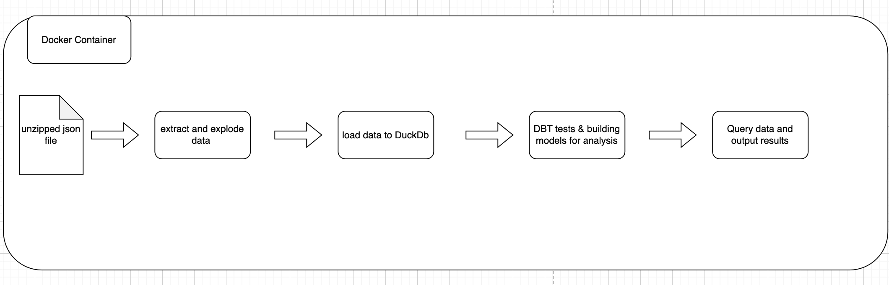
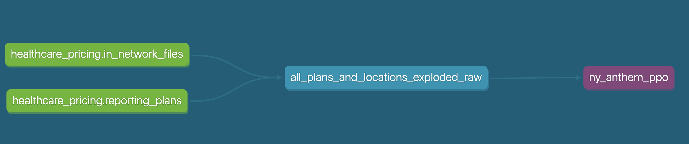
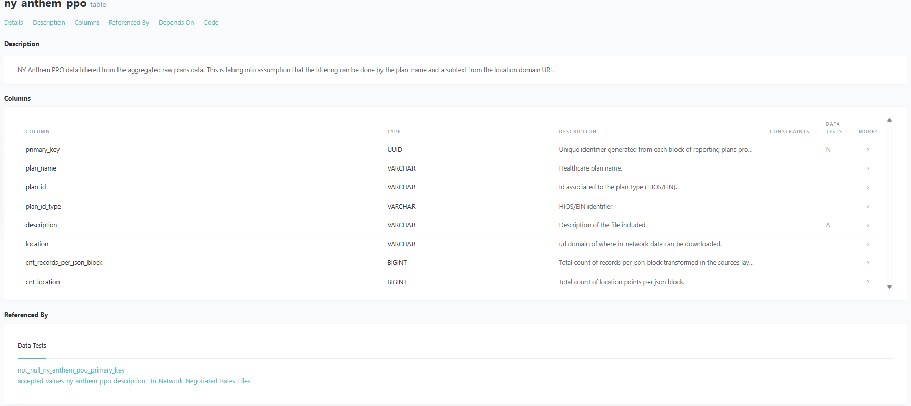

# Pricing Transparency ETL & Analysis

# Introduction
Using data publicly available Anthem machine-readable index file;
the goal is to find the URLs corresponding to Anthem's PPO for New York state.

The challenge in  this exercise is that the data is nested and is provided as a 
many-to-many relationship. The data contract of the fields provided, [CMS data contract HERE](https://github.com/CMSgov/price-transparency-guide/tree/master/schemas/table-of-contents),
provides insight on the keys within a json block but when these fields are nested and the values are different data
types. This results in a game of data mining to flatten the data to analyze it.

The approach taken is that given a long nested json that honors the data contract provided by CMS; 
stream this json and flatten the data by creating separate files for each key and exploding out 
the nested values into json values. This will result in three json files: `allowed_amount_file.json` ,
`in_network_files.json` and `reporting_plans.json`. Each json blob will have a primary key generated so 
that traceability purposes. Then the data is loaded into DuckDb & finally use DBT as the tool establish the Data Lake,
which consists of data tests and lineage of different data models.

The premise is to ensure:
* logging for observability
* fast and smooth local development to extract and analyze data 
* data tests that are easy to generate and scale  
* simple code for extraction and analysis using DBT ensuring data lineage is intact.
* isolated infrastructure for containers to run extraction across several files data at scale.

The output of this analysis of urls pertaining to Anthem NY PPO can be found [HERE](raw_data%2Fny_location_analysis.txt).

# Design
The starting point is an unzipped json file where a python method will stream the data and parse/explode 
it to separate files based on keys within a json block. 

After that, another python method will be used load the exploded json data into a local duckdb database. 

Finally, DBT will be used to establish the Data Lake and lineage of how the data can be interpreted. 
There will be data tests to ensure that the business rules set by the data contract is honored.

Below is a visualization on the design:



# Project Structure
Below are the major commands used -- docstring in the code is available.

1. `/ingestion/main.py` => entry point to poetry commands. `poetry run ingestion --help`
    * `query`  - query data from local duckdb database.
    * `extract-anthem-data` - method to extract and explode data from a json file stored in local machine.
    * `create-anthem-data-in-duckdb` - method to load json files to local duckdb database.
2. `/dbt-duckdb` => module containing dbt code.
    * `sources.yml`  - source data and few data tests to confirm the quality of data.
    * `2_analytics/ny_anthem_ppo.sql` - underlying data model for the analysis of NY PPO url.
    * `2_analytics/schema.yml` - underlying data tests for the analysis of NY PPO url.


# Execution
This project will be using a docker container to retrieve the final outcome of URLs.

```
docker build . -t healthcare_pricing
docker run --rm -it -v "./raw_data:/home/healthcare_pricing/raw_data" -v "./exploded_data:/home/healthcare_pricing/exploded_data" -v "./ingestion:/home/healthcare_pricing/ingestion" -e DUCKDB_PATH='/home/healthcare_pricing/raw_data/anthem_data.db' -e DUCKDB_DATABASE_NAME='anthem_data'  --entrypoint bash -p 8080:8080 healthcare_pricing
```

Command to execute for this analysis:

1. Ensure that the index file is downloaded and unzipped and accessible within the `/raw_data` directory. 
   The index file can be found [HERE](https://antm-pt-prod-dataz-nogbd-nophi-us-east1.s3.amazonaws.com/anthem/2025-03-01_anthem_index.json.gz).
2. Within the docker container the commands to run:
```
# to extract & explode data
poetry run ingestion extract-anthem-data "raw_data/2025-03-01_anthem_index.json"

# to load json data into duckdb
poetry run ingestion create-anthem-data-in-duckdb

# to run source level DBT tests
cd dbt-duckdb/
# seven tests should pass
dbt test --select  "source:*"

# to run DBT analytics model for the NY PPO URLs
dbt run --select +ny_anthem_ppo

# run tests on the model to ensure that description follows the accepted value of In-Network Negotiated Rates Files
dbt test --select ny_anthem_ppo

# to run query for URL outputs requested for this analysis
cd ..
poetry run ingestion query "select distinct plan_id from main_analytics.ny_anthem_ppo" --max-rows 1000  > raw_data/ny_plan_id_analysis.txt
poetry run ingestion query "select distinct location from main_analytics.ny_anthem_ppo order by location" --max-rows 100  > raw_data/ny_location_analysis.txt
```

# Analysis
The goal was to flatten the data and have it accessible to query in favor of parsing through the json
in python and grabbing the URLs. I took this route because it's easier to debug SQL code rather than 
looping through python dictionaries and building out logic on what to extract. Parsing and building logic in python
can get complicated especially with nested jsons with different data types.

Once the data is accessible within a table; I understood that there was a many-to-many relationship between 
each json block meaning a simple query of grabbing a plan name that contains `PPO` or `NY` to retrieve all the 
location url won't yield the result as expected. Also, the plan_name was not consistent ie: `NY`, `New York`, `N.Y.` etc. 
Therefore, I only filtered the plan_name that contained `anthem` and `ppo`. 

Given that there is a many-to-many relationship between the keys of a given json block (`in_network_files` & `reporting_plans`);
the next phase was to understand the `description` and `location` within the `in_network_files`, as mentioned in the `Hints`. 
I noticed a pattern within the `location` ie: `NY_AHPPMED0012_01_10.json.gz`  URL where there was a prefix of `NY_`, 
a combination of 4 character followed up with `MED`. 

Therefore, added a filtering on location where the prefix `NY_` exists. The final filtering used to grab all the 
Anthem NY PPO urls is: plan_name containing `anthem` and `ppo` and `location` containing the prefix of `NY_`. The logic
implementation can be found in the sql script [HERE](dbt-duckdb%2Fmodels%2F2_analytics%2Fny_anthem_ppo.sql).
I also noticed the descriptions of these combination also revealed that the description all these locations were `In-Network Negotiated Rates Files`, I added this a data test once the model 
`ny_anthem_ppo` was generated.
The Anthem NY PPO urls can be found [HERE](raw_data%2Fny_location_analysis.txt).


Finally, I randomly cross-referenced the plan_id [HERE](raw_data%2Fny_plan_id_analysis.txt) to  the [Anthem EIN lookup](https://www.anthem.com/machine-readable-file/search/).
I noticed that the location URL followed a pattern `NY_` and then `_PPO_` followed up with texts. The `PPO` was missing in the
`ny_location_analysis.txt` output. For example, lookup return `NY_PPO_HYREMED0029.json.gz` and the output of this analysis 
from the index file contains the URL `NY_HYREMED0029.json.gz`.

We can leverage this EIN lookup to remove plan_ids that are not New York based. A more in-depth feature is described 
under `Future State`. 


# Future State
* I'd update the starting point of this analysis to include a method to download the
index file without manually doing this. Also, a method unzipping the file to a json file. 
* I would add another method to the ingestion process. In this step, I'll see
if there is an API to Anthem EIN lookup and pass in all the `plan_id` that I believe are Anthem NY PPO.
The results I will store in another source table, `ein_lookup_table`, for analysis. 
* And finally, within DBT, I'll join the ein_lookup_table to `ny_anthem_ppo` and find out 
whether for a given json blob (primary key) if there is at least one `plan_id` that has a location 
mapped in the `ein_lookup_table`.
  * The logic here is that there is a possibility that a business that isn't NY is mapped 
  to a location URL that contains `NY_`, given that there is a many-to-many relationship, we are not filtering the plan
  name to have any phrase of `NY`. 
  * If the goal is to find plan_ids that are Anthem NY PPO then we will need to map to 
  the `ein_lookup_table` as check if the plan_id has an associated location between `in_network_files` &  `ein_lookup_table`.
  This will also require a small update to the location field to include `ppo`, before the mapping, 
  as mentioned in the Analysis. Below contains a data model example of `ein_lookup_table` & using the model `ny_anthem_ppo` we can quickly create a
  sql join and filtering to ensure that locations within the index file for a given plan appears in the potential lookup
  table.
```
┌────────────┬──────────────────────────────────────────────────────────────────────────────────────────────────────┐
│  ein_id    │                                           location                                                   │
│  varchar   │                                         list(varchar)                                                │
├────────────┼──────────────────────────────────────────────────────────────────────────────────────────────────────┤
│ 13-3999322 │ [CA_ELHO_ELHS_ELHOMEDELHO.json.gz, NY_PPO_HYREMED0029.json.gz,                                       │
│            │   2025-03_NH_35B0_in-network-rates_2_of_4.json.gz]                                                   │
│ 13-3447560 │ [2025-03_MD_08B0_in-network-rates_6_of_35.json.gz, NY_PPO_HXQTMED0000.json.gz]                       │                              │
│ 11-3615133 │ [NY_EPO_HXQTMED0000.json.gz]                                                                         │ 
├────────────┴──────────────────────────────────────────────────────────────────────────────────────────────────────┤
│ 3 rows (3 shown)                                                                                      2 columns   │
└───────────────────────────────────────────────────────────────────────────────────────────────────────────────────┘
```


# Additional Notes
The time it takes to run this process end to end is roughly 20 minutes. 
Although the answer can be found within 10 minutes if I used python to stream the data and filter through
dictionaries to grab the necessary URL. I took the longer route in flatten the data so that
analyzing the data via query is easier and readable to follow the process and to interpret the data.

For this analysis, I also wanted to highlight the logging wih record counts of each of the breakout table 
which then can be aggregated up into an observability tool to better understand the volume of data.

Also, added the data tests part of the data lineage to ensure whatever logic that is put in place holds (example 
description for all Anthem NY PPO URLs is `In-Network Negotiated Rates Files`) & that all any stakeholder can visually 
follow the flow of data and what it represents. DBT Docs shines here as in the example below:




To access the docs:

```bash
cd dbt-duckdb/
dbt docs generate
dbt docs serve --host 0.0.0.0 --port 8080
```
The url http://localhost:8080 contains the dbt docs, which contains a data lineage and data definitions.
Finally, in this analysis the code is meant to be to run in isolation, whether that be a container in ECS, EKS, ECS.